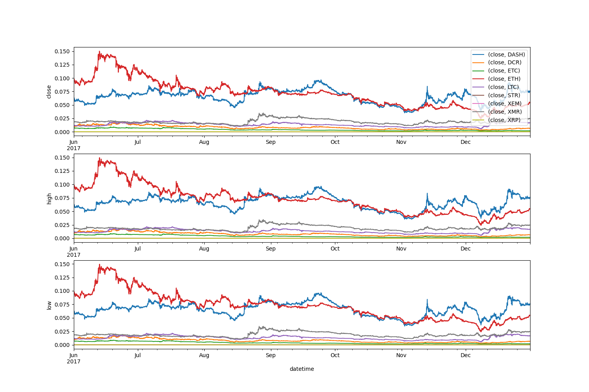
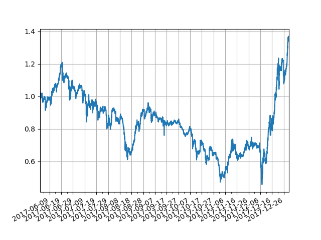

# Portfolio Management

This is an implementation of the portfolio management solution described in the following paper:
[A Deep Reinforcement Learning Framework for the Financial Portfolio Management Problem](https://arxiv.org/abs/1706.10059).
The purpose of this project was to make the code more flexible than the original implementation for education purposes & further usage in different applications.

## Requirements
* Code tested with `Python 3.7.9`, `pytorch 1.8.0`, `cuda 11.1` & `cudnn 8.0` on `Windows 10`
* Requirements are installed from the `Pipfile.lock`
( all commands are run at the `Pipfile` folder level).
  
To install your dependencies run:
```shell
pipenv sync
```
To activate the environment:
```shell
pipenv shell
```

Finally install `pytorch` ( you should be in the pipenv environment while doing this step, `pipenv` does not support `--find links / -f`):
```shell
pip install torch==1.8.0+cu111 torchvision==0.9.0+cu111 torchaudio==0.8.0 -f https://download.pytorch.org/whl/torch_stable.html
```

## Train
```shell
python train.py
--config_file config/crypto.yaml
--storage_path
/path/to/data/logging
```

## Test
```shell
python backtest.py
--config_file config\crypto.yaml
--storage_path
/path/to/data/logging
```


## Concrete Backtest
* These are the results after running the following command:
```shell
python backtest.py
--config_file
config\crypto_test_2017.yaml
--storage_path
\path\to\aiie_crypto_storage
```

#### Prices



#### Relative results


* After a six month period of trading the agent made a +40% profit. But we can see that the portfolio value 
was not stable at all. Therefore, there is place for a lot of improvement.

